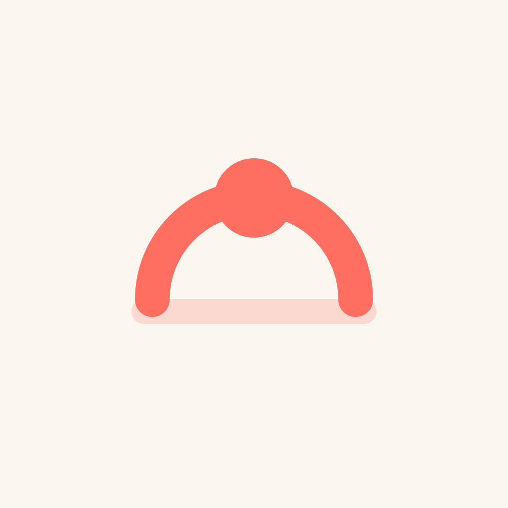
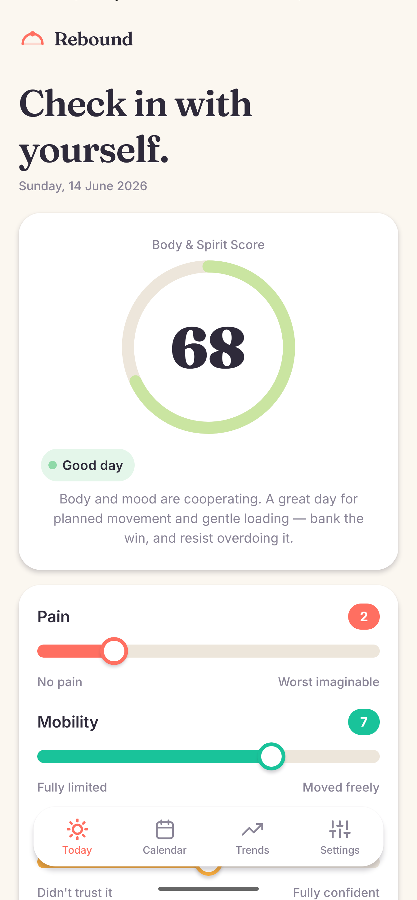
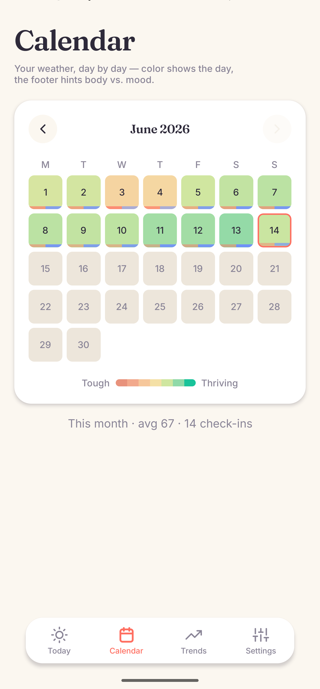
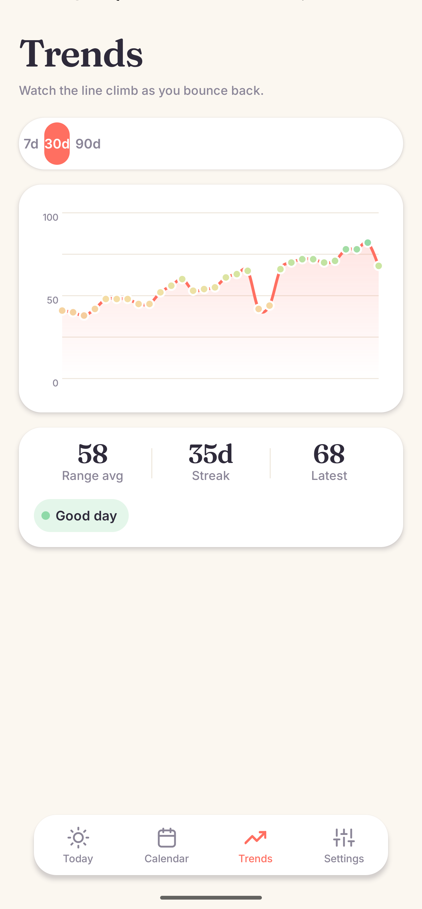
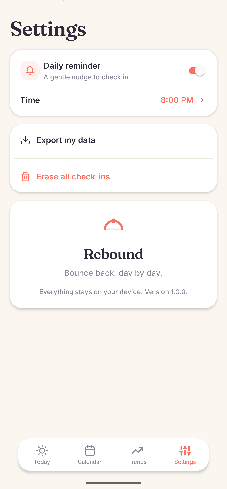

<p align="center">
  
</p>

<h1 align="center">Rebound</h1>

<p align="center"><em>Bounce back, day by day.</em></p>

<p align="center">
  A private, local-first companion for living with an injury — track how your recovery
  <em>feels</em>, in body <strong>and</strong> mind, and watch the line climb.
</p>

<p align="center">
  
  
  
  
  
</p>

---

## Why Rebound?

Recovering from an injury is as much a head game as a body one. A bad day isn't just pain — it's the frustration, the fear of re-injury, the dip in mood when progress stalls. Most trackers only count reps or log pain on a 1–10 scale. **Rebound tracks the whole picture** — physical *and* emotional — and frames every bad day as **data, not failure**.

It started as a way to track a stubborn knee, but nothing about it is knee-specific: use it for a back, a shoulder, a post-surgery recovery, or any nagging injury you want to understand over time.

## What it does

A **sub-minute daily check-in** across six evidence-informed dimensions rolls up into a single **0–100 Body & Spirit Score**, then becomes a warm calendar heatmap and a trend line so your recovery becomes visible — and, on the good days, worth celebrating.

- 🎚️ **Daily check-in** — six 0–10 sliders with haptic detents, plus a free-text note
- 🌡️ **Body & Spirit Score** — one friendly 0–100 number across five supportive bands
- 🗓️ **Weather calendar** — a month heatmap where each day is tinted by its score, with a dual-tone footer hinting body vs. mood at a glance
- 📈 **Trends** — a smooth 7 / 30 / 90-day line, with average, streak, and current band
- 🔔 **Daily reminder** — a gentle local notification at a time you choose
- 🔒 **Private by design** — everything stays on your device. No account, no cloud, no tracking

## Screens

|  Today  |  Calendar  |  Trends  |  Settings  |
| :-----: | :--------: | :------: | :--------: |
|  |  |  |  |

## The science behind the score

The six dimensions are drawn from injury & rehabilitation psychology — recovery depends on far more than pain level. Negative items (pain, fear) are inverted so that **higher always means better**, then each is weighted and summed into a 0–100 composite.

| Dimension | What it captures | Weight |
| --- | --- | :---: |
| **Pain** | Pain intensity (inverted) | 0.20 |
| **Mobility** | Functional movement — walking, stairs, bending | 0.20 |
| **Mood** | Affect & morale | 0.20 |
| **Confidence** | Self-efficacy — trust in the injured area | 0.15 |
| **Fear of movement** | Kinesiophobia — avoidance / fear of re-injury (inverted) | 0.15 |
| **Sleep** | Sleep quality | 0.10 |

Scores fall into five non-judgemental bands — **Tough day → Struggling → Holding steady → Good day → Thriving** — each with a short, supportive companion message that nudges toward steady, anti–boom-bust pacing.

## Tech

Local-first and dependency-light by design.

- **[Expo](https://expo.dev) SDK 56** · React Native 0.85 · expo-router (file-based navigation)
- **[expo-sqlite](https://docs.expo.dev/versions/latest/sdk/sqlite/)** behind a single repository seam (`src/data/entriesRepository.ts`) — ready for an optional backend sync later
- **expo-notifications** for the daily local reminder
- **react-native-reanimated** + gesture-handler for the springy interactions; **react-native-svg** for the score dial, heatmap, trend chart, and the hand-rolled icon set (no icon font, no chart library)
- **Fraunces** + **Inter** via `@expo-google-fonts`
- Forced light theme — warm *Paper Dawn* canvas with *Dawn Coral* and *Spring Mint* accents

```
src/
├── app/                # expo-router screens (Today, Calendar, Trends, Settings, day detail)
├── components/         # ScoreDial, ScoreSlider, MonthHeatmap, TrendChart, Confetti, Icon, …
├── scoring/            # the six dimensions + the 0–100 composite and bands
├── data/               # SQLite schema + entriesRepository (the persistence seam)
├── notifications/      # daily reminder scheduling
└── theme/              # palette, tokens, brand
```

## Run it locally

**Prerequisites:** Node 20+, a JDK (**17** recommended), the Android SDK + platform-tools, and an Android device or emulator.

```bash
git clone https://github.com/Piryus/rebound.git
cd rebound
npm install

# generate the native Android project from app config
npx expo prebuild --platform android

# build, install on a connected device, and start Metro
npx expo run:android
```

Day to day after the first build, just start the bundler and press `a`:

```bash
npx expo start --dev-client
```

> 📦 Building a standalone APK for yourself, or publishing to the Play Store later? See **[docs/RELEASE.md](docs/RELEASE.md)**.

## Roadmap

- [ ] Personalize what you're tracking (e.g. label it "left knee" / "lower back")
- [ ] Per-dimension trend overlays & correlations (sleep vs. pain, mood vs. mobility)
- [ ] Full-year contribution-style heatmap
- [ ] Optional encrypted backend sync / multi-device (the repository seam is ready)
- [ ] iOS build & App Store packaging
- [ ] Accessibility pass (dynamic type, screen-reader labels)

## Contributing

Issues and PRs are welcome. See **[CONTRIBUTING.md](CONTRIBUTING.md)**.

## License

[MIT](LICENSE) © Emile Legendre

<p align="center"><sub>Rebound is a personal-wellbeing tool, not a medical device. It does not diagnose, treat, or give medical advice — talk to a qualified clinician about your injury.</sub></p>
